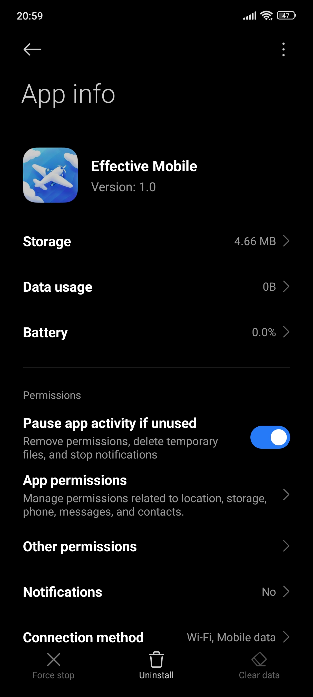
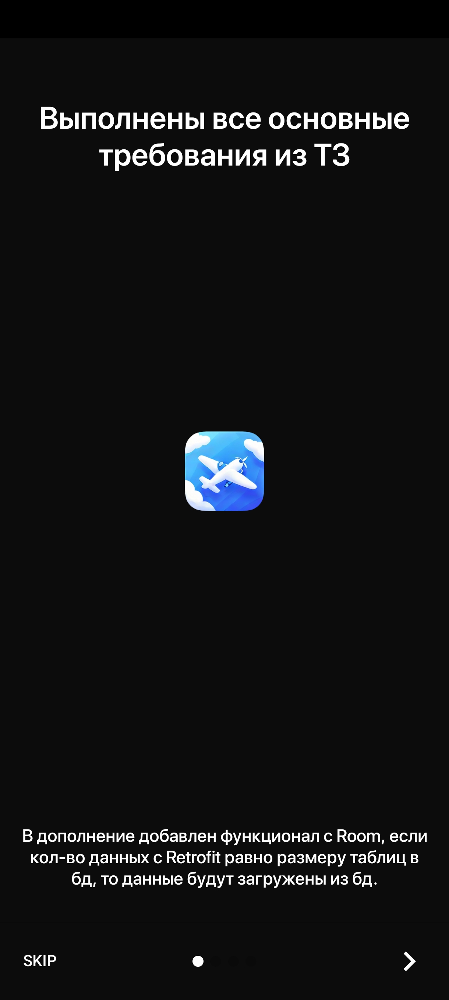
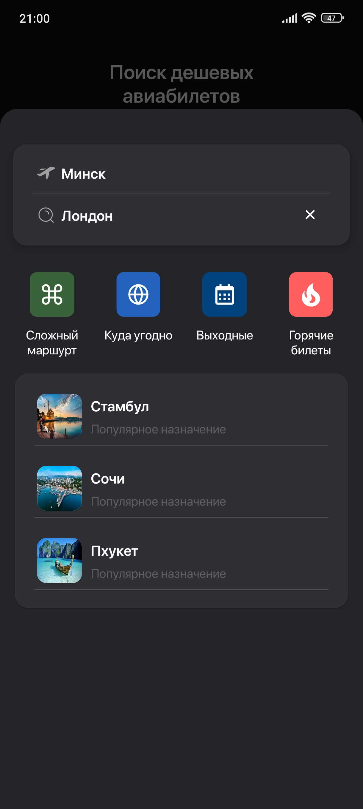
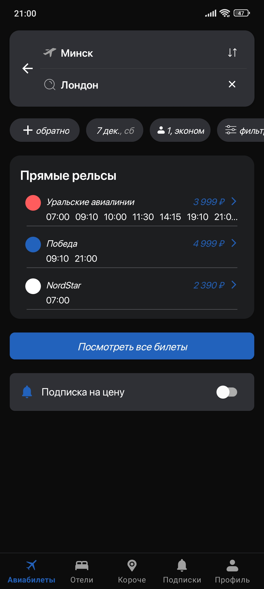
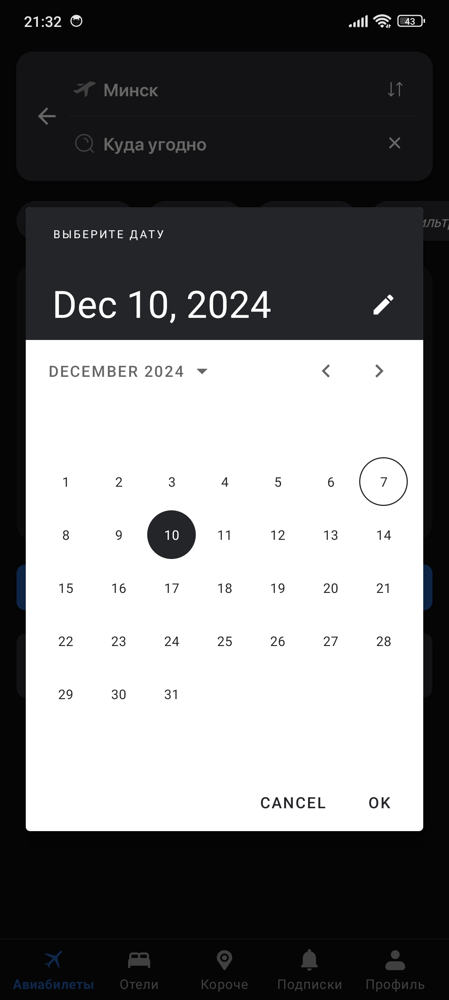
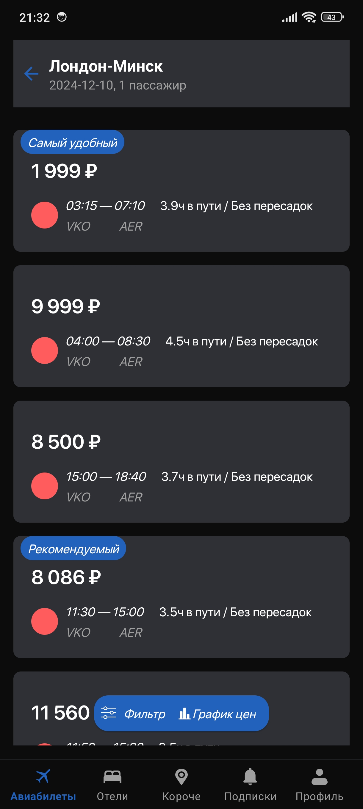

Выполнялось с вечера вторника 03.12 по вечер субботы 07.12
При первом входе в приложение есть небольшое интро.
Дополнительные фрагменты не делал, но есть Room + другая логика.
Есть рабочий R8 для релизной версии

![Screenshot 7](screenshots/Screenshot_2024-12-07-21-33-02-687_com.kawler.effmobile.jpg
